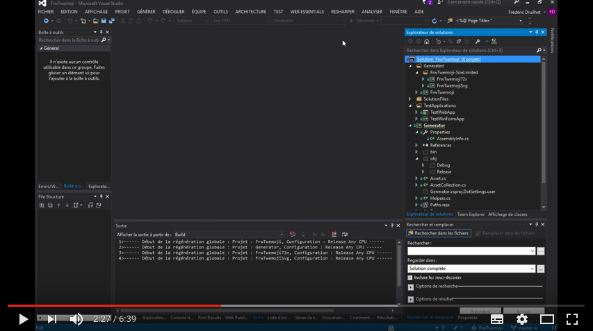

# FrwTwemoji

<script async src="https://pagead2.googlesyndication.com/pagead/js/adsbygoogle.js"></script>

The main purpose of FrwTwemoji project is to have twitter emojis hosted in any .net or mono project.

Twemoji is the twitter initiative to open source emoji pictures and javascript parser : [twitter/twemoji](https://github.com/twitter/twemoji))

The goal is to include those pictures as resources (and WebResources) and also to have a .net parser to detect emoji caracters and display the right pictures at the right place.

## Video presentation on YouTube (Subtitled in english)

[](https://www.youtube.com/watch?v=mB6zVCylQtU)

## Informations

* [Project Source](https://github.com/FrenchW/FrwTwemoji)
* People : 
   - [FrenchW](http://github.frenchw.net) (Twitter [@FrenchW](https://twitter.com/FrenchW))
* [Downloads](#downloads) 
* Content :
   - [EmojiDisplay WebControl](#WebControl)
   - [Simple parser](#simpleparser)
   - [Twitter's original javascript](#javascript) as WebResource
* [Help](Help.md)

## Current version 12.1.2.0 (updated sept 13, 2019)

See [changelog](Changelog.md) for more information

## Downloads<a id="downloads" name="downloads"></a>

You can download the latest FrwTwemoji assemblies for a direct use here :
  - English [https://frenchw.net/en/frwtwemoji/](https://frenchw.net/en/frwtwemoji/)
  - French [https://frenchw.net/frwtwemoji/](https://frenchw.net/frwtwemoji/) 

## What's new in version 12.1.20

FrwTwemoji now refers to twemoji 12.1.2.

It includes all new unicode V.10 Emojis. It allows you to use all the new emojis, complex associations gender and skin tones variants like these:
 


<!-- github-mid -->
<ins class="adsbygoogle"
     style="display:block"
     data-ad-client="ca-pub-5683856818165673"
     data-ad-slot="6677529772"
     data-ad-format="auto"
     data-full-width-responsive="true"></ins>


## EmojiDisplay WebControl <a id="WebControl" name="WebControl"></a>

### Usage
Simply drop EmojiDisplay control on your web Page, set rendering options and add some text containing emojis :

```csharp
<h2>Emoji Display</h2>
<cc1:EmojiDisplay ID="EmojiDisplay1"
    runat="server"
    Text="Today, Twitter is open sourcing their emoji 
        to share with everyone  ?? ?? ?? ?? ?? ?? ?? ?? ?? ?" />
```
You can easily set it to use MaxCdn (version 2) or your embeded ressources (all is in the Dll file)

and it displays like this : 
 
 


## Simple parser <a id="simpleparser" name="simpleparser"></a>

Anywhere, use the Parser function to get the string converted with string + images

### Usage

```csharp
MyHtmlSpanElement.InnerHtml = 
    FrwTwemoji.Parser.ParseEmoji(SomeStringContainingEmojiCaracters);
```

## Twitter Original javascript <a id="javascript" name="javascript"></a>
The original twitter javascript twemoji is also included as a WebResource : the minified one (set the argument to true) or not (false)

```csharp
// Easy way, get simply the url and use it in your code :
LitJavascriptUrl.Value = Javascript.GetJavascriptRessourceUrl(false);
// wich outputs : [ Literal "LitJavascriptUrl" ]

// Or the full way
Javascript.AddJavascriptToPageClientScript(true); 
// wich adds the ClientScript block to the page. 
```

<!-- github-footer -->
<ins class="adsbygoogle"
     style="display:block"
     data-ad-client="ca-pub-5683856818165673"
     data-ad-slot="7112837565"
     data-ad-format="auto"
     data-full-width-responsive="true"></ins>

<script>
     (adsbygoogle = window.adsbygoogle || []).push({
          google_ad_client: "ca-pub-5683856818165673",
          enable_page_level_ads: true
     });
</script>
